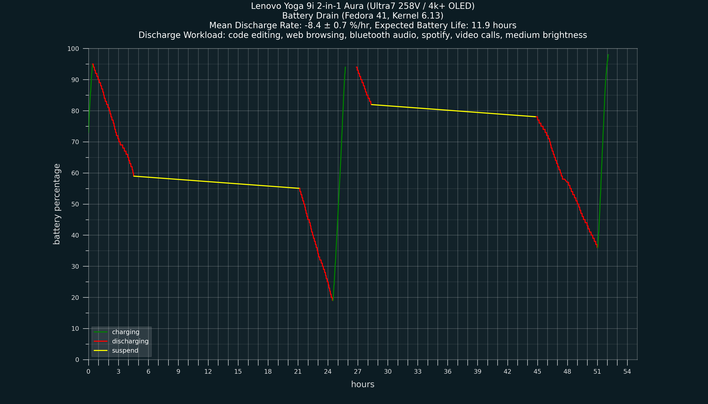
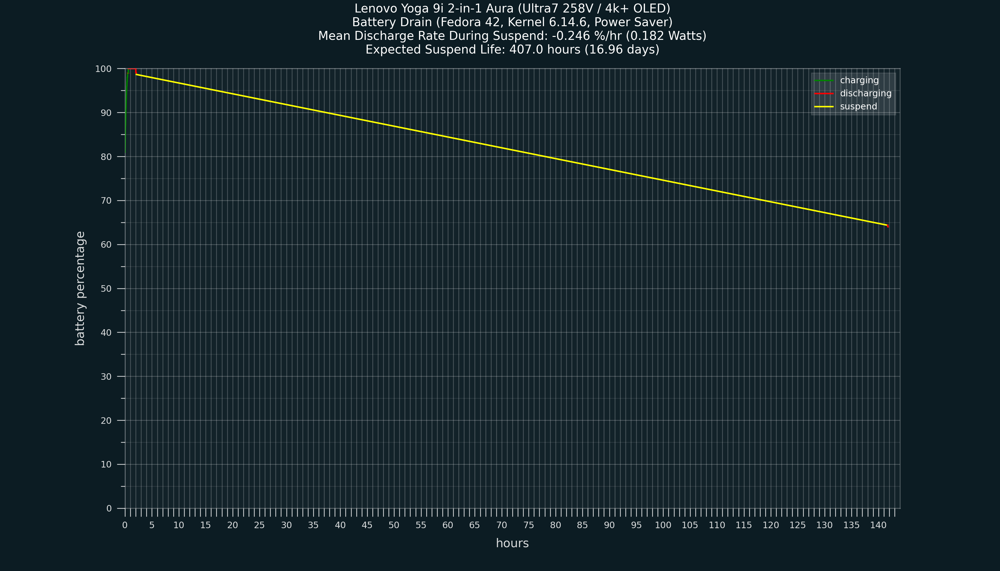

All major functionality is working in recent versions of kernel & firmware, with some simple config updates.
Distros that favor older versions of these for general stability may take a few more months to receieve the necessary changes.

I recommend using the latest stable Fedora as a starting point.
I haven't done a fresh install to fully test this, but I believe the only issues you might face in Fedora are bluetooth and audio related.

If Bluetooth doesn't work, follow the "Bluetooth Fix" section below (create a couple symlinks).

If audio doesn't work, follow the Alsa UCM step in the "Troubleshooting Audio" section below (download some config files and reset alsa).

If you have any issues, the best place to ask might be on [this thread](https://forums.lenovo.com/t5/Other-Linux-Discussions/Linux-Support-Yoga-9i-2-in-1-Aura/m-p/5363703) on the Lenovo forums.

Feel free to open issues or PRs if you have something to ask or share!

# General Stability

There is currently a power management bug that can sometimes cause the CPU cores to get "stuck" in their low-power state (400MHz) for about 1 minute when waking from suspend. This rarely happens to me, and I've never seen this issue persist longer than 1 minute, but [reports](https://www.phoronix.com/review/lunarlake-xe2-windows-linux-2025) from similar models (like the X1 Carbon Aura) suggest it's possible they remain stuck unless you switch to the "Performance" power mode (ie in Gnome settings).

There is also a rare full system freeze issue that requires reboot, perhaps most likely to occur just after wakeup, but the cause of this is unknown. Perhaps it's related to the issue above. I've seen this twice.

A similar rare bug is a full system freeze followed by a forced reboot shortly after. I've experienced this twice, both times while playing a [game](https://www.cavesofqud.com) with very simple graphics. I'm not sure of the cause for this one either, perhaps the CPU/GPU load is related.

So far, I've never had a crash occur with my typical workload (fairly light apps like a browser, vscode, slack, spotify, etc).

# Feature Support

Most testing below was done on Fedora 41.

✅ Should work on kernel 6.12+, earlier verisons unknown:
* wifi
* fingerprint reader
* ambient light sensor
* disabling keyboard / touchpad in tablet mode
  * only works when fully rotated flat
  * older configurations may require fully closing the laptop to re-enable keyboard / touchpad
  * see [Tablet Mode Workaround](tablet-mode-workaround.md) for more details

✅ Working on 6.14 (and some 6.13, via driver backport, eg Fedora), not working on 6.12 or earlier:
* touchscreen input
* pen/stylus - touch input, pressure, tilt, side buttons

✅ Working but may require manual fixes:
* audio (may work with newer firmware / kernel, or require a simple config refresh. See "Troubleshooting Audio" section below):
  * internal speaker output
  * internal microphone input
  * headphone jack output
* bluetooth
  * firmware is temporarily misconfigured upstream for some Lunar Lake chipsets, see "Bluetooth Fix" below if you have an issue.
* suspend
  * some distros may wake immediately due to trackpad wake events, easy to fix, see "Troubleshooting Suspend" section below
* the copilot key is recognised as a bizzare key macro, but can be remapped (for example, to Right Ctrl) using the Input Remapper software (see "Key Remapping" below) on 6.14 (remapping untested on 6.13 or earlier).

⚠️ Partially working
* "special" keys on keyboard
  * the power mode key (top right below "delete") works as expected in Fedora -- this may be distro / desktop dependent
  * the audio settings key on the right can be used / remapped out-of-the-box (keycode 149 "KEY_PROG2")
  * several other keys emit keycode 240 "KEY_UNKNOWN" ("mode" key Fn+F9, Fn+F11, and the eyeball & hollow star on the bottom right)
    * these can only partially be used (see "Key Remapping" below), and they likely overlap with each other, so you cannot map different functions to each special key independently. (Currently, in Fedora 42 / 6.14.9, `FnF9(mode), FnF11(screens), hollow star` are grouped together, and `eyeball, S-star` are grouped together. This may change over time, across distros, and/or across kernels)
  * all other keys work as expected

❌ Not working:
* accelerometer (for disabling keyboard / touchpad in "tent" mode, >180deg rotation)
  * see [Tablet Mode Workaround](tablet-mode-workaround.md) for more details

❗ Other issues:
* When waking from a long suspend, sometimes there is temporary lag for around 1 minute
* There seems to be a very rare full system freeze issue that can happen, which requires a hard reboot.

❓ Untested:
* headphone jack mic input (probably fine?)
* touchscreen support with kernel 6.13 on other distros
* kernel versions below 6.12


# Bluetooth Fix

As of March 15 2025, Fedora stable firmware breaks bluetooth. Other distros running newer versions of `linux-firmware` will probably have the same issue. Run this:

```sh
sudo dmesg | grep -i bluetooth
```

If you have a line like this:

```
[    3.646023] Bluetooth: hci0: Failed to load Intel firmware file intel/ibt-0190-0291-pci.sfi (-2)
```

Then follow the steps below.

The issue can be fixed by symlinking some firmware files:

```sh
sudo ln -s /lib/firmware/intel/ibt-0190-0291.sfi /lib/firmware/intel/ibt-0190-0291-pci.sfi
sudo ln -s /lib/firmware/intel/ibt-0190-0291.ddc /lib/firmware/intel/ibt-0190-0291-pci.ddc
```

Reboot. It might also require:

```sh
sudo dracut --force
# (note: your distro might use `initramfs`)
```

before reboot.
If that doesn't work, update firmware with upstream and retry,

```sh
mkdir bt-fw-backup
sudo mv /lib/firmware/intel/ibt-0190-* bt-fw-backup
git clone https://git.kernel.org/pub/scm/linux/kernel/git/firmware/linux-firmware.git
sudo cp linux-firmware/intel/ibt-0190-* /lib/firmware/intel/
```


# Key Remapping

The [Input Remapper](https://github.com/sezanzeb/input-remapper) app can convert the "unknown" key events, pen buttons, the co-pilot key, etc, into other key events / macros. Limitations:

* Some special keys will do the same thing, and can't be remapped independently.
* With the exception of the copilot key, the special key events emitted by the Lenovo drivers do not have a "held" state (they instantly trigger a "key up" event after the initial "key down"), so you can't exactly simulate holding a modifier key like `Ctrl` (but there is a workaround below).

After installing, click the "Ideapad Extra Buttons" section, add a preset, click "record", record the key stroke, and then enter a macro in the field to the right.

### Example 1

Hold down Ctrl for 1 second when an unknown key is pressed -- this gives you a moment to use it as a normal modifier,

```js
key_down(KEY_LEFTCTRL).wait(1000).key_up(KEY_LEFTCTRL)
```

### Example 2

Remap the unknown keys to `XF86Launch1` so it can then be bound as usual from your desktop environment settings,

```js
key(XF86Launch1)
```

Now, this key should work as a generic extra key that you can bind commands to (confirmed to work in Gnome). There are many other random key names that you can bind if this doesn't work.

Or of course, or you just can map that one key to a macro / sequence of keys, and use that same sequence as a key shortcut in your desktop settings.

### Example 3

You can remap buttons on the stylus / pen too. To do this, select the "Wacom [...] Pen" device, add an input, and click record. If the pen is far from the screen, the pen buttons will not emit any events. Make sure the pen is hovering above the screen, controlling the mouse, before pressing the button you want to remap while recording. The remapper will capture several events related to tilt and movement, so you have to click "advanced" and manually remove those entries. You should end up with a single input event named "Button STYLUS" or similar. Now you can remap this to whatever you want, for example Ctrl+Space,

```js
modify(KEY_LEFTCTRL, key(KEY_SPACE))
```

(This was useful for the RNote app, which apparently doesn't handle this "Button STYLUS" event natively. The other button works as expected in RNote though. This is likely app-dependent, so it's nice to know these can simply be remapped.)

### Suggested setup

* copilot key remapped to `KEY_RIGHTCTRL` (works as a normal key, ie with distinct keyup / keydown events)
* unknown keys remapped to `XF86Launch1` as a generic app launcher
* favourites key (star with "S" in it at top) remapped to `XF86Launch3` as a generic app launcher (note that the "audio settings" key is already mapped to Launch 2)
* pen buttons remapped as needed for your drawing software


# Battery Life


Using "Balanced" power mode (Gnome 47 / Fedora 41)


Suspend test (Fedora 42, kernel 6.14.6)



# Troubleshooting Suspend

Some distros may immediately wake from suspend. One cause is erroneous wake signals from the touchpad.

If you suspect you have this issue, try suspending via your desktop environment or systemctl suspend, and wait a few seconds. If suspend fails / your login screen pops back up without any input, then run this:

```sh
sudo cat /sys/kernel/debug/wakeup_sources
```

and see if there is a "ELAN" device with a bunch of numbers. For example, the problem device may look like `i2c-ELAN06FA:00`. To check if it's the source  of your problem, run

```sh
echo "disabled" | sudo tee /sys/bus/i2c/devices/i2c-ELAN06FA:00/power/wakeup
```

and try suspending again. If your laptop suspends properly, then you just need to run this every boot to fix the issue permanently.

For systemd (Ubuntu, Fedora, many others), you can use a service file to do this:

```sh
sudo nano /etc/systemd/system/disable-elan-wakeup.service
```

add these lines:

```ini
[Unit]
Description=Disable wakeup for ELAN trackpad
After=multi-user.target

[Service]
Type=oneshot
ExecStart=/bin/sh -c 'echo "disabled" > /sys/bus/i2c/devices/i2c-ELAN06FA:00/power/wakeup'
RemainAfterExit=true

[Install]
WantedBy=multi-user.target
```

then enable the service

```sh
sudo systemctl daemon-reload
sudo systemctl enable disable-elan-wakeup.service
sudo systemctl start disable-elan-wakeup.service
```

# Troubleshooting Audio

If you want to try fixing audio on outdated systems, you may try these steps. This is not an exhaustive list.

## Update Linux Firmware

⚠️ As of March 14, 2025, bluetooth may be broken on some newer firmware releases.
See the "Bluetooth Fix" section for a fix.

If you have a version of linux firmware newer than March 14, 2025, you should skip this and try the Alsa UCM and sof firmware steps below.

Updating from an old linux firmware version is likely to help fix audio issues.

https://gitlab.com/kernel-firmware/linux-firmware

Your distro may have a mechanism to install newer testing versions.

## Update Audio Packages / Config

Updating `sof firmware` and/or `Alsa UCM` configs may fix audio issues.

### Step 1

First, try downloading & installing the latest Alsa UCM, instructions:
https://github.com/alsa-project/alsa-ucm-conf?tab=readme-ov-file#installation

Example:
```sh
# tested commit c3314b9ca29861d19164d2b3987745b7170dab06
cd ~/Downloads
curl -L -o alsa-ucm-conf.tar.gz https://github.com/alsa-project/alsa-ucm-conf/archive/refs/heads/master.tar.gz
sudo tar xvzf alsa-ucm-conf.tar.gz -C /usr/share/alsa --strip-components=1 --wildcards "*/ucm" "*/ucm2"

# ensure config is re-generated
sudo systemctl stop alsa-state
sudo rm /var/lib/alsa/asound.state
sudo systemctl start alsa-state
```

Reboot and check if any sound issues have been resolved.

### Step 2

Next you can try downloading & installing the latest `sof` firmware, instructions:
https://github.com/thesofproject/sof-bin?tab=readme-ov-file#install-process-with-installsh---release-tarballs

Example:
```sh
wget https://github.com/thesofproject/sof-bin/releases/download/v2025.01/sof-bin-2025.01.tar.gz
tar xf sof-bin-2025.01.tar.gz
cd sof-bin-2025.01
sudo ./install.sh
```

Reboot and check if any sound issues have been resolved.

# Misc

(April 24, 2025) There is currently a strange bug that crashes Gnome entirely, sending you back to the login screen. It seems to happen when:
* you are in tablet mode with the on-screen keyboard open
* you click a button on certain GTK dialog boxes, like a "save" dialog box

For example, saving a file within RNote with the on-screen keyboard open will likely cause a crash (your file should be saved correctly though).

This is a complex interaction between Mutter/Wayland and Gnome, *possibly* related to GTK or other apps.
