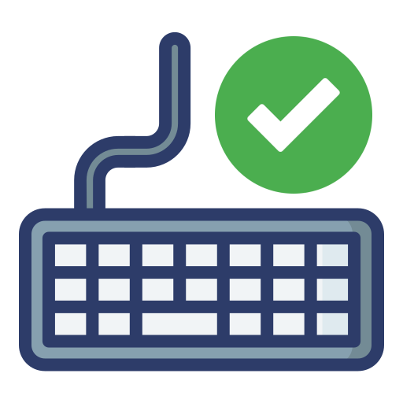

# Tablet Mode Workaround

"Tablet mode" is an event that most desktop environments should use to disable touchpad / keyboard when the laptop is rotated into a tablet.

There is one magnetic switch for fully-rotated mode, and there is also an accelerometer that can be used to trigger tablet mode, but sadly (as of April 1, 2025) the firmware/drivers for the accelerometer are not working in Linux.

Previous kernels/firmware may only detect the event for enabling tablet mode, forcing you to fully close the laptop to disable it (re-enable the keyboard / touchpad).

Recent versions may detect the disabling event too. However, this means you can't disable the keyboard / touchpad in "tent" mode.

This guide explains a process that should allow enabling / disabling tablet mode with terminal commands, which can then be bound to keyboard shortcuts and desktop launcher icons.

# Instructions

We will be using the `evemu` tool to record and play input events, ensure this is installed with `which evemu-record`.

First you need to find the device number for the tablet mode switch. Running `sudo evtest` will list device names. On my laptop the event is currently called "Lenovo Yoga Tablet Mode Control switch" and it is device 11 (yours may differ slighly).

Now run the record command and trigger tablet mode by fully rotating the screen, and un-rotating it:

```sh
sudo evemu-record /dev/input/event11 > tablet-mode-events.txt
```

If you can't record the "disable" event because you are forced to close your laptop, just reference my outputs below to manually define the event.

You can then edit this one file into 2 files, one for enabling tablet mode, and one for disabling it. Mine look like this, and I've placed them in `/opt`:

```sh
$ cat /opt/tablet-mode.off.evemu
# EVEMU 1.3
[...]
################################
#      Waiting for events      #
################################
E: 0.000001 0005 0001 0000	# EV_SW / SW_TABLET_MODE       0
E: 0.000001 0000 0000 0000	# ------------ SYN_REPORT (0) ---------- +0ms

$ cat /opt/tablet-mode.on.evemu
# EVEMU 1.3
[...]
################################
#      Waiting for events      #
################################
E: 0.000001 0005 0001 0001	# EV_SW / SW_TABLET_MODE       1
E: 0.000001 0000 0000 0000	# ------------ SYN_REPORT (0) ---------- +0ms
```

Only the bottom 2 lines should differ in your event files.

You can test them out with something like this

```sh
$ sudo evemu-play /dev/input/event11 < /opt/tablet-mode.on.evemu ; sleep 5 ; sudo evemu-play /dev/input/event11 < /opt/tablet-mode.off.evemu
```

Now, we want a simple way to trigger the "off" event from the touchscreen. The method I'm using involves creating a script to play the event, setting the script up for password-less sudo execution, and creating a desktop shortcut that can just be tapped on the touchscreen.

```sh
# NOTE: yours might not be event 11! (running `sudo evtest` should list the event names)
$ cat /opt/tablet-mode.on.sh
#!/bin/bash
evemu-play /dev/input/event11 < /opt/tablet-mode.on.evemu

$ cat /opt/tablet-mode.off.sh
#!/bin/bash
evemu-play /dev/input/event11 < /opt/tablet-mode.off.evemu

# ensure the scripts are executable!
$ sudo chmod +x /opt/tablet-mode.on.sh
$ sudo chmod +x /opt/tablet-mode.off.sh

# set up password-less sudo execution for these scripts
$ sudo visudo
# add these lines to the bottom, changing to your username:
john ALL=(ALL) NOPASSWD: /opt/tablet-mode.off.sh
john ALL=(ALL) NOPASSWD: /opt/tablet-mode.on.sh

# Distro specific: create launcher icons in your desktop env.
# The following works for Gnome:

$ cat ~/.local/share/applications/tablet-mode-on.desktop
[Desktop Entry]
Name=Tablet Mode On
Exec=sudo /opt/tablet-mode.on.sh
Icon=preferences-desktop
Terminal=false
Type=Application
Categories=Utility;

$ cat ~/.local/share/applications/tablet-mode-off.desktop
[Desktop Entry]
Name=Tablet Mode Off
Exec=sudo /opt/tablet-mode.off.sh
Icon=preferences-desktop
Terminal=false
Type=Application
Categories=Utility;
```

If you want some decent icons for your shortcuts, you can use these:




```ini
[Desktop Entry]
Name=Tablet Mode Off
Icon=/path/to/tablet-mode-disable.png
...

[Desktop Entry]
Name=Tablet Mode On
Icon=/path/to/tablet-mode-enable.png
...
```
